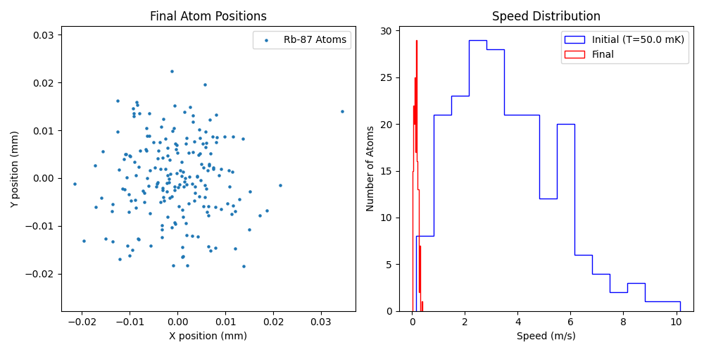
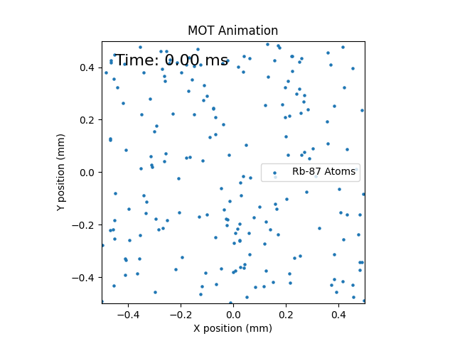

# 2D Laser Cooling Simulation

Project Title: 2D Laser Cooling Simulation (Magneto-Optical Trap)

Description: This project simulates the 2D laser cooling of atoms within a Magneto-Optical Trap (MOT). It models the forces acting on atoms (Doppler cooling and magnetic trapping), including spontaneous emission and recoil. The simulation visualizes the atomic motion and cooling process, generating a plot of final atom positions and speed distribution, and an animated GIF of the MOT dynamics, specifically for Rubidium-87 atoms.

